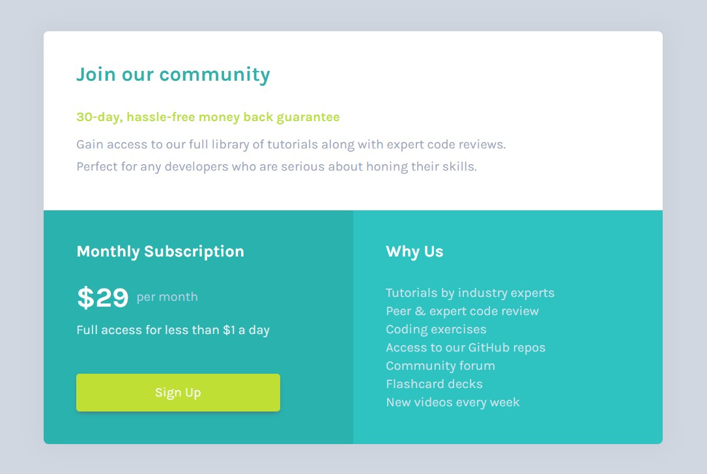

# Frontend Mentor - Single price grid component solution

這是[Single price grid component challenge on Frontend Mentor](https://www.frontendmentor.io/challenges/single-price-grid-component-5ce41129d0ff452fec5abbbc)的解答。  
Frontend Mentor challenges 是一個藉由實際建立專案，來提升 coding 技術的挑戰。

## 大綱

- [總覽](#總覽)
  - [關於這份挑戰](#關於這份挑戰)
  - [螢幕截圖](#螢幕截圖)
  - [網站連結](#連結)
- [工作流程](#工作流程)
  - [使用的工具](#使用的工具)
  - [我學到什麼](#我學到什麼)
- [關於作者](#關於作者)
- [致謝](#致謝)

## 總覽

### 關於這份挑戰

你的挑戰是建立出這一個價格組件，盡你所能的讓它能夠看起來越接近設計稿越好。
你可以使用任何你喜歡的工具來完成這份挑戰。所以如果你有某個你想要練習的工具，就盡管去嘗試吧！

提示－使用者應該要能夠：

- 根據手上的裝置螢幕尺寸來獲得最佳化的佈局
- 在電腦中滑鼠懸停狀態時有 "呼籲（CAT）" 的效果

### 螢幕截圖



### 連結

- Live Site URL: [Here](https://jubeatt.github.io/Single-price-grid-component/)

## 工作流程

### 使用的工具

- Mobile-first workflow
- Semantic HTML5 markup
- Flexbox

- [reset.css](https://meyerweb.com/eric/tools/css/reset/) - For style
- [box-shadow-generator](https://html-css-js.com/css/generator/box-shadow/) - For style

### 我學到什麼

```css
.price_grid {
  width: 85%;
  min-width: 320px;
  max-width: 960px;
}
```

- `width: 85%`  
  讓容器變成是有流動（伸縮）的元素，能夠隨著螢幕寬度做變化。
- `min-width: 320px`  
  限制容器的最小寬度（避免當解析度過小時的問題）。
- `max-width: 960px`  
  限制容器的最大寬度（避免當解析度過大的問題）。

```css
.row {
  box-sizing: border-box;
  padding: 20px 30px 30px;
}
```

```css
.row:nth-child(2) .price {
  display: inline-block;
  vertical-align: middle;
}
```

- `display: inline-block`  
  讓"$29"，與 "per month"可以並排在一起。
- `vertical-align: middle`  
  讓"$29"，與 "per month"可以置中對齊。

```css
.btn {
  max-width: 250px;
}
```

- `max-width: 250px`，讓按鈕在桌機板畫面時不會被放得過大。

```css
@media screen and (min-width: 760px) {
  body {
    height: 100vh;
    display: flex;
    flex-direction: column;
    justify-content: center;
  }
}
```

桌機版時，這裡要讓整個組件出現在螢幕的正中間。  
因此這裡先設定`display: flex`，將 body 設為一個 flex 空間，  
接著在設置`height: 100vh`，讓 body 容器的高等於可視範圍（瀏覽器視窗）
接著在透過`flex`中的`flex-direction: column`與`justify-content: center`來實現。  
（變更主軸的方向、使 flex 中的子物件對齊主軸中間的位置）

```css
@media screen and (min-width: 760px) {
  .price_grid {
    display: flex;
    flex-wrap: wrap;
  }
}
```

由於`flex-wrap`的預設值是`nowrap`，所以這裡更改為`wrap`，使得 flex 空間中的子物件能夠換行。

```css
@media screen and (min-width: 760px) {
  .row:nth-child(1) {
    flex-basis: 100%;
  }
}
```

為了這個：


```css
@media screen and (min-width: 760px) {
  .row:nth-child(2) {
    flex-basis: 50%;
  }
  .row:nth-child(3) {
    flex-basis: 50%;
  }
}
```

為了這個：


另外，由於 flex 空間會讓子物件自動等高，所以如果沒有做調整的話，畫面看起來會沒有那麼對稱，像這樣：


如果你還是不太理解為什麼會這樣的話，你可以在參考以下：

```css
@media screen and (min-width: 760px) {
  .price_grid {
    align-items: flex-start;
  }
}
```


所以為了讓` .row:nth-child(2)`中的內容可以比較對稱，所以我們加上以下代碼：

```css
@media screen and (min-width: 760px) {
  .row:nth-child(2) {
    display: flex;
    flex-direction: column;
    justify-content: space-around;
  }
}
```

- `display: flex`  
  建立一個 flex 空間。
- `flex-direction: column`  
  更改 flex 的主軸方向。
- `justify-content: space-around`  
  讓 flex 空間中的子物件相等間距。

最後你就完成了這個：


最後一個部分，按鈕的"呼籲（CAT）" 的效果：


```css
@media screen and (min-width: 760px) {
  .btn {
    transition: background-color 0.5s;
  }
  .btn:hover {
    background-color: hsl(71, 73%, 30%);
  }
}
```

## 關於作者

- Website - [Jim's blog](https://jubeatt.github.io/)
- Frontend Mentor - [Jim](https://www.frontendmentor.io/profile/jubeatt)
- Facebook - [薛裕正](https://www.facebook.com/profile.php?id=100003593580513)

## 致謝

這是我第一個完成的 Frontend Mentor 挑戰。  
雖然只是個小專案，不過藉由這份練習，也讓自己複習了一些之前所學過的一些技巧。  
希望未來能繼續把每一個 Frontend Mentor 中的挑戰都陸續給完成。  
最後也很謝謝作者提供了 Frontend Mentor 這個平台，讓我們這些學習前端知
識的人可以藉此來練習自己的技巧，

如果你發現這份專案中有什麼錯誤的地方，或者是有什麼建議的話，都歡迎你利用 Frontend Mentor 的留言系統給我回饋，或者你也可以直接[寄信](mailto:jimdevelopesite)給我。
