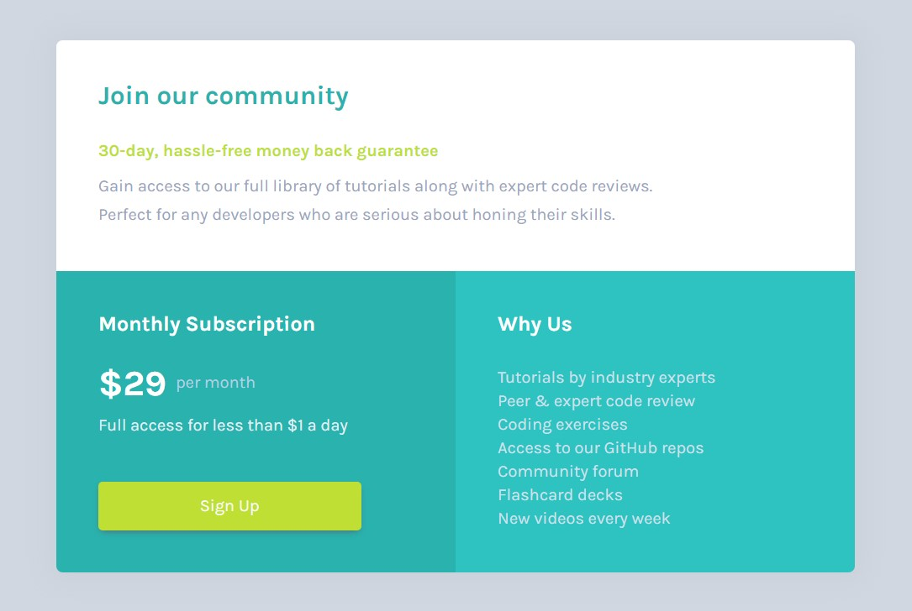
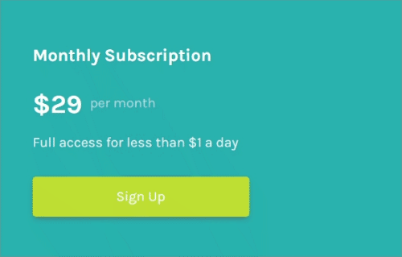

# Frontend Mentor - Single price grid component solution

This is a solution to the [Single price grid component challenge on Frontend Mentor](https://www.frontendmentor.io/challenges/single-price-grid-component-5ce41129d0ff452fec5abbbc). Frontend Mentor challenges help you improve your coding skills by building realistic projects.

**<font size="4">友情提示：如果你想看中文解說，可以點[這裡](https://github.com/jubeatt/single-price-grid-component/blob/master/README-zh.md)🎉</font>**

## Table of content

- [Overview](#overview)
  - [The challenge](#the-challenge)
  - [Screenshot](#screenshot)
  - [Links](#links)
- [My process](#my-process)
  - [Built with](#built-with)
  - [What I learned](#what-i-learned)
- [Author](#author)
- [Acknowledgments](#acknowledgments)

## Overview

### The challenge

Users should be able to:

- View the optimal layout for the component depending on their device's screen size
- See a hover state on desktop for the Sign Up call-to-action

### Screenshot



### Links

- Live Site URL: [Here](https://jubeatt.github.io/single-price-grid-component/)

## My process

### Built with

- Mobile-first workflow
- Semantic HTML5 markup
- Flexbox

- [reset.css](https://meyerweb.com/eric/tools/css/reset/) - For style
- [box-shadow-generator](https://html-css-js.com/css/generator/box-shadow/) - For style

### What I learned

```css
.price_grid {
  width: 85%;
  min-width: 320px;
  max-width: 960px;
}
```

- `width: 85%`  
  To Make the element is fluid, so it can change its width following the window.

- `min-width: 320px`  
  To restrict the element's minimum width, (to prevent it's too small when on a small screen or resolution)

- `max-width: 960px`  
  To restrict the element's maximum width, (to prevent it's too big when on a large screen or resolution)

```css
.row {
  box-sizing: border-box;
  padding: 20px 30px 30px;
}
```

- `box-sizing: border-box`  
  Because we set padding to the element, so we have to change the calculation of box modal, and then it won't be overflow by its width from the container.

```css
.row:nth-child(2) .price {
  display: inline-block;
  vertical-align: middle;
}
```

- `display: inline-block`  
  To make "$29" and "per month" side by side.
- `vertical-align: middle`  
  To make "$29" and "per month" center aligned.

```css
.btn {
  max-width: 250px;
}
```

- `max-width: 250px`  
  To restrict the button max-width, so it won't be scaled too
  large on desktop version.

```css
@media screen and (min-width: 760px) {
  body {
    height: 100vh;
    display: flex;
    flex-direction: column;
    justify-content: center;
  }
}
```

For desktop, our goal is to set the component to the middle of the layout.  
So first we set `display: flex` to create a flex-box from body,  
and then we set `height: 100vh`, to make its height equal to viewport (by the browser window)  
and we use `flex-direction: column` and `justify-content: center` to implement our goal.  
(Change main-axis direction to column / make flex-item object can be center of main-axis from the flex-box.)

```css
@media screen and (min-width: 760px) {
  .price_grid {
    display: flex;
    flex-wrap: wrap;
  }
}
```

Because the default value of `flex-wrap` is `nowrap`, so we change it to `wrap`.  
So the flex-item in flex-box can be wrap now.

```css
@media screen and (min-width: 760px) {
  .row:nth-child(1) {
    flex-basis: 100%;
  }
}
```

It's for this:


```css
@media screen and (min-width: 760px) {
  .row:nth-child(2) {
    flex-basis: 50%;
  }
  .row:nth-child(3) {
    flex-basis: 50%;
  }
}
```

It's for this:


Additionally, because the default setting for flex-item will make them have the same height. so if we don't change the setting, it will seem not symmetrical by the view. like this:


If you still don't know what that means, you can the following test :

```css
@media screen and (min-width: 760px) {
  .price_grid {
    align-items: flex-start;
  }
}
```


To fix this problem, we can add the following code:

```css
@media screen and (min-width: 760px) {
  .row:nth-child(2) {
    display: flex;
    flex-direction: column;
    justify-content: space-around;
  }
}
```

- `display: flex`  
  Create a flex-box.
- `flex-direction: column`  
  Change the direction of main axis to column.
- `justify-content: space-around`  
  Make flex-items are Equal spacing.

Finally, you finished it:


Here is the last part. Call-To-Action effect for the sign-up button:



```css
@media screen and (min-width: 760px) {
  .btn {
    transition: background-color 0.5s;
  }
  .btn:hover {
    background-color: hsl(71, 73%, 30%);
  }
}
```

## Author

- Website - [Jim's blog](https://jubeatt.github.io/)
- Frontend Mentor - [Jim](https://www.frontendmentor.io/profile/jubeatt)
- Facebook - [薛裕正](https://www.facebook.com/profile.php?id=100003593580513)

## Acknowledgments

This is my first completion challenge of Frontend Mentor.  
Although it's just a small project, it reminds me of some skills I have learned before.  
I hope I could keep trying to finish the rest of the challenges in the future.

In the end, I want to say thank you to the author who created this platform.  
It helps people who are learning programs, just like me.

If you find anything wrong with this project or have any suggestions for me.please give me a reply by using the guestbook from Frontend Mentor or you can send me a [mail](mailto:jimdevelopesite) directly.
